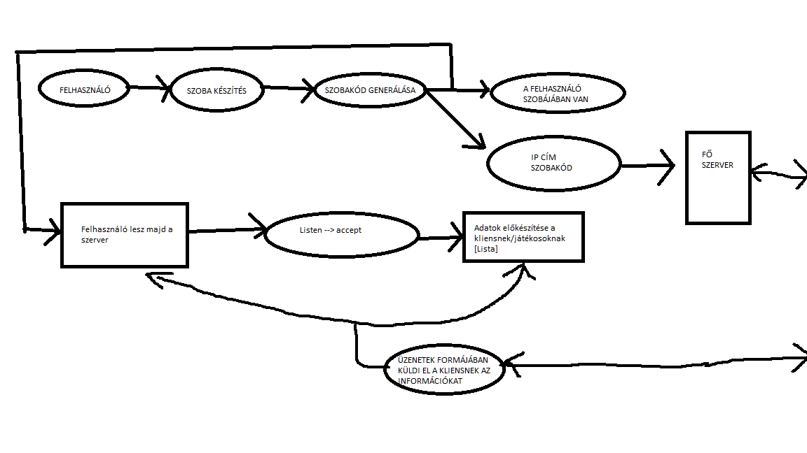
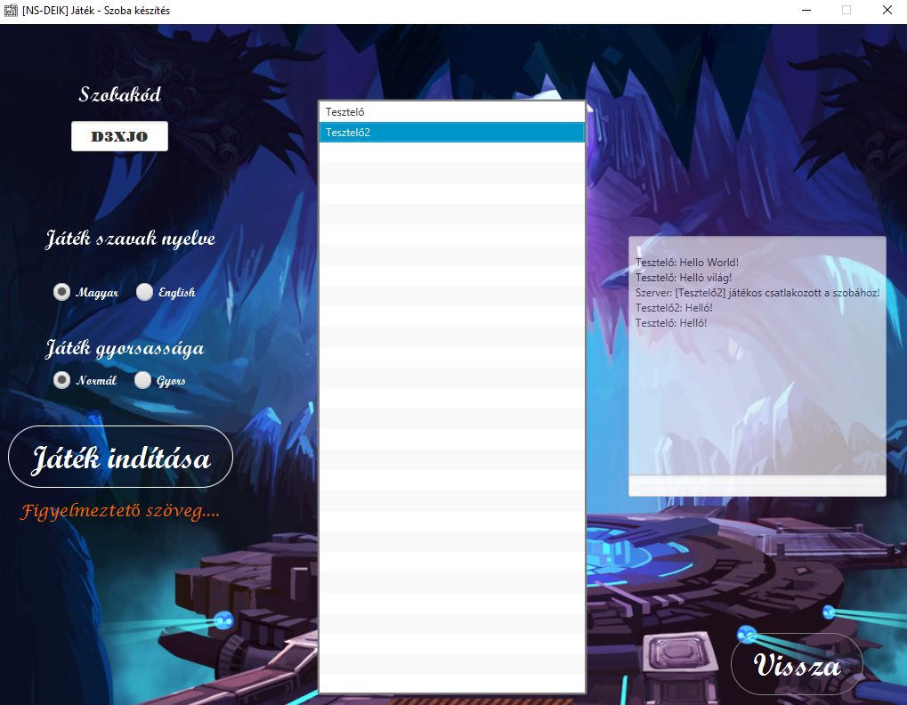
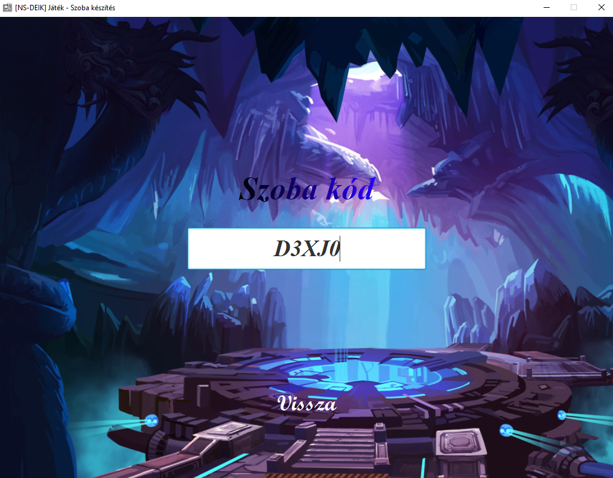
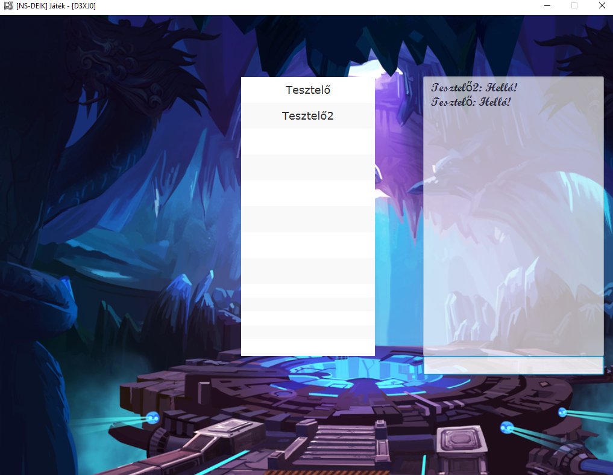
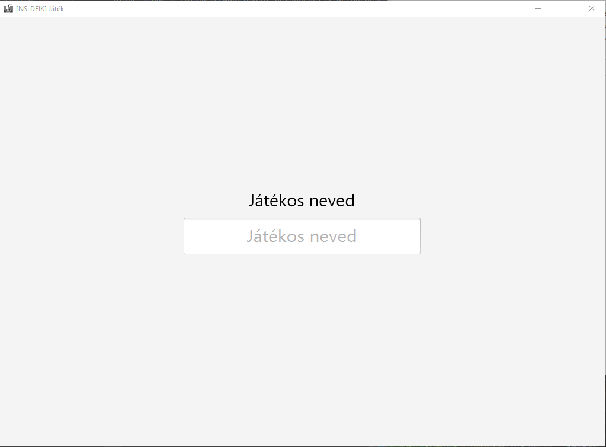
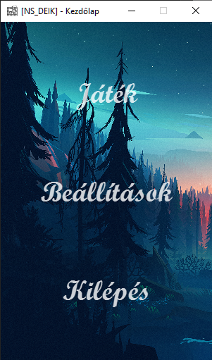
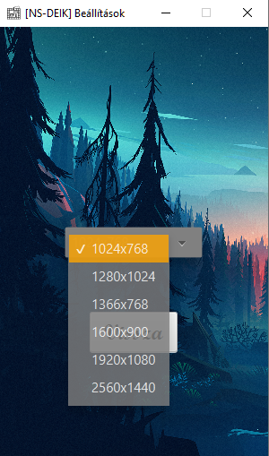
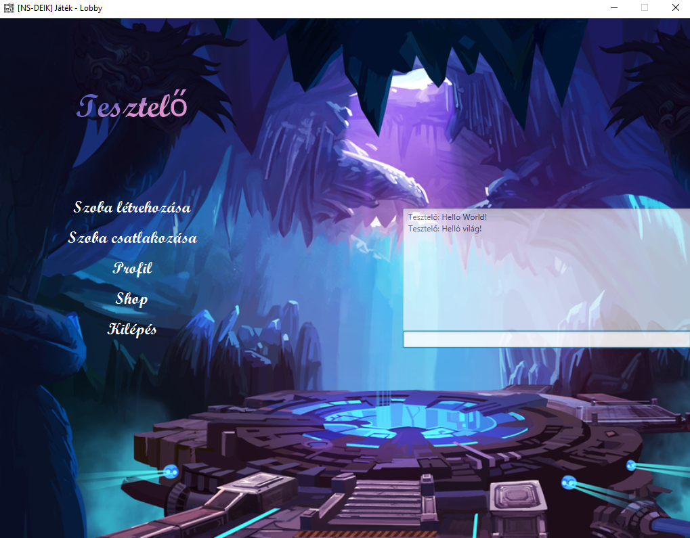
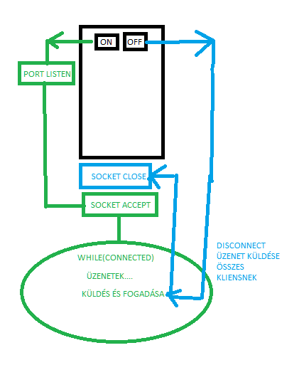
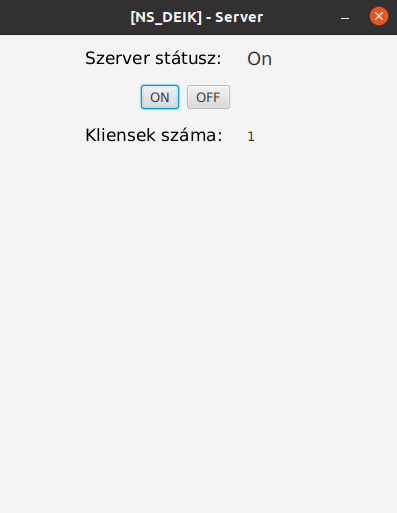

#[NS_DEIK] Projekt

---

* ## NS_KLIENS
  * #### gameroom
    * ##### room_create
      |Működése | Kép |
      |-|-|
      |||
    * ##### room_join
      |Működése | Kép |
      |-|-|
      |Játékos beírja a szobakódot, és megnyomja az entert, akkor elküldi az üzenetet a fő szervernek, hogy létezik-e a szobakód, és mi az ip címe a kliens-szervernek?||
      |Ha sikeres a szobakód, akkor rácsatlakozik a szobára, és megkapom a kliens-szervertől az adatokat (kik vannak bent?)||
    * Data/DataType/User
      |Működése |
      |-|
      |Röviden: User --> Eltárolja felhasználói adatokat (ip címe, neve, stb.) |
      | Data/DataType --> Üzenetek formája, milyen típusa a csomagnak. Pl. chat típusa --> akkor chat formájában kapom meg az információkat (pl. tartalom) |

  * #### homepage
    * ##### GameController
        |Működése | Kép |
        |-|-|
        |Beírjuk a játékos nevüket, ezután átdobja lobby controllernek||
    * ##### HomepageController
        |Működése | Kép |
        |-|-|
        |Itt lehet választani a menüt, ha játék gombra megyünk rá (gamecontrollernek dobja át), és így tovább...||
    * ##### SettingsController
        |Működése | Kép |
        |-|-|
        |Itt be lehet állítani a képernyő méretét||
  * #### lobby
    * ##### GameLobbyController
        |Működése | Kép |
        |-|-|
        |Ha sikeres a kapcsolat főszerverrel, akkor kiírja a nevünket...||
  * #### mainServer
    * ##### MainServer
        |Működése|
        |-|
        |Főszerver csatlakozása, és egyéb dolgok kezelése |
    * ##### SInterface
  * #### Server
    * DataType,MainData
        |Működése |
      |-|
      |Üzenetek formája, típusa, kommunikálása főszerverrel|
* ## NS_SZERVER
  * Server
      |Működése | Kép |
      |-|-|
      ||
